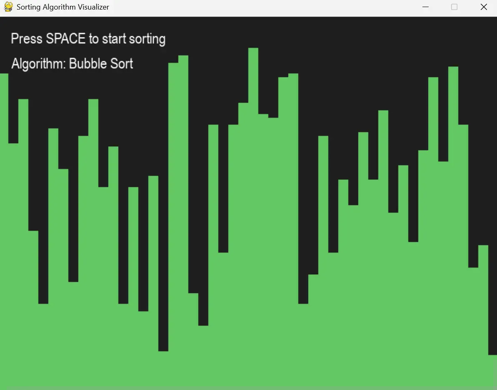
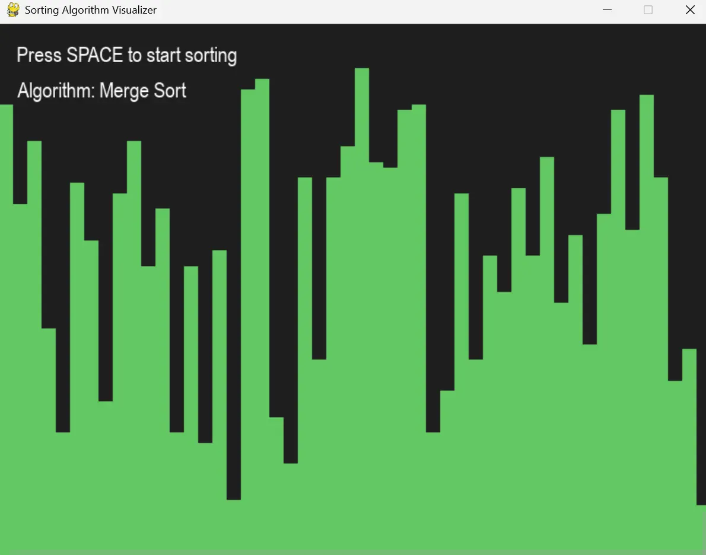

# Sorting Algorithm Visualizer

An interactive Python application that visualizes popular sorting algorithms in real-time using Pygame. Watch as different sorting algorithms organize data through animated bar charts, helping you understand how each algorithm works step-by-step.

## Technology Stack

**Language:**
- Python 3.x

**Libraries:**
- Pygame - Graphics and visualization
- Random - Array generation
- Pytest - Unit testing

## Features Overview

### Sorting Algorithms
- **Bubble Sort** - Simple comparison-based algorithm
- **Quick Sort** - Efficient divide-and-conquer algorithm
- **Merge Sort** - Stable divide-and-conquer algorithm

### Visualization
- Real-time animated bar chart representation
- Color-coded bars for easy tracking
- Smooth transitions showing algorithm progress
- Dark-themed interface for comfortable viewing

### Interactive Controls
- **SPACE** - Start/restart sorting animation
- **RIGHT ARROW** - Cycle through different algorithms
- Visual feedback showing current algorithm
- Dynamic array generation

### Educational Value
- Step-by-step visualization of sorting process
- Compare different algorithm behaviors
- Understand time complexity through visual speed
- Perfect for learning data structures and algorithms

## Screenshots

### Bubble Sort Visualization


Real-time visualization of Bubble Sort algorithm comparing and swapping adjacent elements.

### Quick Sort Visualization


Quick Sort in action, showing the partition-based approach to sorting.

### Merge Sort Visualization


Merge Sort demonstrating the divide-and-conquer strategy with recursive splitting and merging.

## Installation & Setup

### Prerequisites
- Python 3.7 or higher
- pip package manager

### Steps

1. **Clone the repository**
```bash
   git clone https://github.com/Rafat-i/sorting-visualizer.git
   cd sorting-visualizer
```

2. **Create a virtual environment (recommended)**
```bash
   # Windows
   python -m venv .venv
   .venv\Scripts\activate

   # macOS/Linux
   python3 -m venv .venv
   source .venv/bin/activate
```

3. **Install dependencies**
```bash
   pip install -r requirements.txt
```

4. **Run the application**
```bash
   python -m src.main
```

## Project Structure
```
sorting-visualizer/
├── .venv/                    # Virtual environment (not in repo)
├── src/
│   ├── __init__.py          # Package initializer
│   ├── algorithms.py        # Sorting algorithm implementations
│   ├── main.py              # Main application entry point
│   └── utils.py             # Utility functions (array generation, drawing)
├── tests/
│   └── test_algorithms.py  # Unit tests for sorting algorithms
├── screenshots/             # Application screenshots
│   ├── bubble-sort.png
│   ├── quick-sort.png
│   └── merge-sort.png
├── .gitignore              # Git ignore file
├── README.md               # Project documentation
└── requirements.txt        # Python dependencies
```

## Usage

### Controls

- **SPACE** - Start the sorting animation
- **RIGHT ARROW** - Switch to the next sorting algorithm
- **ESC/Close Window** - Exit the application

### Customization

You can modify the array size and value range in `main.py`:
```python
array = generate_array(50, 10, 100)  # (size, min_value, max_value)
```

Adjust visualization speed by changing the clock tick rate:
```python
CLOCK.tick(30)  # Increase for faster animation, decrease for slower
```

Customize colors in `utils.py`:
```python
COLORS = {
    "background": (30, 30, 30),
    "bar": (100, 200, 100),
    "bar_highlight": (200, 100, 100),
    "text": (255, 255, 255)
}
```

## Algorithm Details

### Bubble Sort
- **Time Complexity:** O(n²)
- **Space Complexity:** O(1)
- **Description:** Repeatedly compares adjacent elements and swaps them if they're in the wrong order

### Quick Sort
- **Time Complexity:** O(n log n) average, O(n²) worst case
- **Space Complexity:** O(log n)
- **Description:** Uses a pivot element to partition the array into smaller and larger elements

### Merge Sort
- **Time Complexity:** O(n log n)
- **Space Complexity:** O(n)
- **Description:** Divides the array into halves, sorts them, and merges them back together

## Running Tests

The project includes unit tests for all sorting algorithms using pytest:
```bash
# Run all tests
pytest tests/

# Run with verbose output
pytest tests/ -v

# Run specific test
pytest tests/test_algorithms.py::test_bubble_sort
```

## Development

### Adding a New Sorting Algorithm

1. **Implement the algorithm in `src/algorithms.py`:**
```python
   def insertion_sort(arr):
       for i in range(1, len(arr)):
           key = arr[i]
           j = i - 1
           while j >= 0 and arr[j] > key:
               arr[j + 1] = arr[j]
               j -= 1
               yield arr
           arr[j + 1] = key
           yield arr
```

2. **Add to algorithm dictionary in `src/main.py`:**
```python
   ALGORITHMS = {
       "Bubble Sort": bubble_sort,
       "Quick Sort": quick_sort,
       "Merge Sort": merge_sort,
       "Insertion Sort": insertion_sort  # Add new algorithm
   }
```

3. **Create a test in `tests/test_algorithms.py`:**
```python
   def test_insertion_sort():
       array = [5, 3, 8, 6, 2]
       sorted_array = list(insertion_sort(array))[-1]
       assert sorted_array == sorted(array)
```

## Future Improvements

### Features
- Add more sorting algorithms (Heap Sort, Radix Sort, Counting Sort)
- Algorithm complexity information display
- Side-by-side comparison mode
- Speed control slider
- Custom array input
- Sound effects for comparisons and swaps
- Step-by-step mode with pause/play controls
- Export visualization as video/GIF

### Technical
- Performance optimizations for larger arrays
- Better GUI with menu system
- Save/load array configurations
- Algorithm statistics (comparisons, swaps)
- Responsive window resizing
- Dark/light theme toggle

### Educational
- Tutorial mode with explanations
- Quiz mode to test understanding
- Complexity analysis charts
- Best/worst case scenario demonstrations

